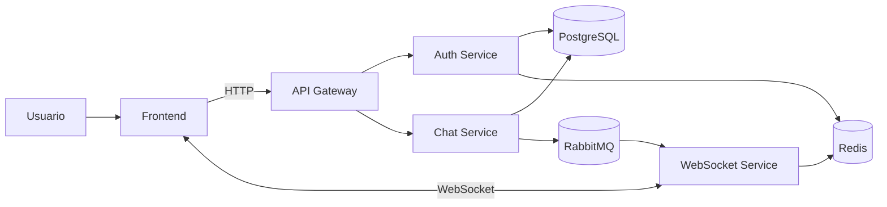

# Arquitetura da Aplicacao

## Fluxo principal

1. O frontend envia requisicoes HTTP para o API Gateway.
2. O Gateway encaminha autenticacao ao Auth Service e conversas ao Chat Service.
3. O Chat Service salva as mensagens no PostgreSQL e publica eventos no RabbitMQ.
4. O WebSocket Service recebe os eventos e entrega as atualizacoes ao frontend.
5. O Redis gerencia tokens revogados e auxilia a comunicacao entre instancias WebSocket.
