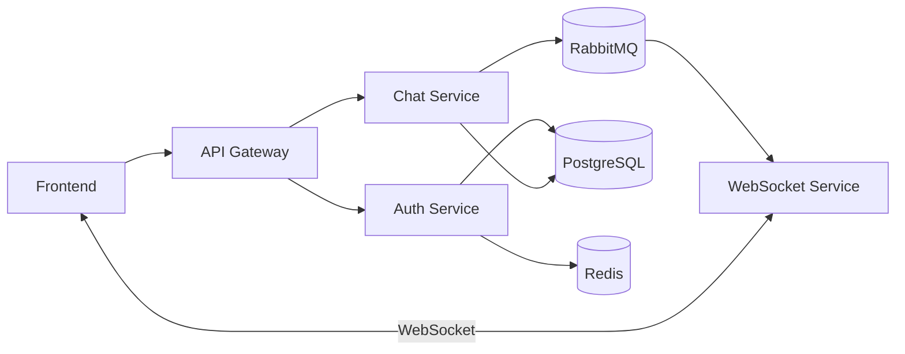

# Chat Distribuído

Projeto desenvolvido para a disciplina de Sistemas Distribuídos.

## Objetivo

Desenvolver uma plataforma de comunicação em tempo real baseada em microsserviços, capaz de suportar:

* Autenticação de usuários
* Conversas privadas (1:1)
* Conversas em grupo (1:N)
* Comunicação em tempo real via WebSocket
* Persistência de mensagens
* Escalabilidade horizontal
* Arquitetura distribuída baseada em eventos

---

# Arquitetura do Projeto

```text
chat-distribuido/

├── frontend/
│
├── api-gateway/
│
├── auth-service/
│
├── chat-service/
│
├── websocket-service/
│
├── docker-compose.yml
│
└── README.md
```

---

# Diagrama da Arquitetura



---

# Tecnologias

## Frontend

* React
* TypeScript
* Socket.IO Client
* Axios

## Backend

* NestJS
* TypeScript

## Banco de Dados

* PostgreSQL

## Cache

* Redis

## Mensageria

* RabbitMQ

## Containers

* Docker
* Docker Compose

---

# Responsabilidades dos Serviços

## Frontend

Responsável por:

* Login
* Cadastro
* Lista de conversas
* Envio de mensagens
* Recebimento de mensagens em tempo real

Não possui regra de negócio.

Toda comunicação deve ocorrer através do API Gateway.

---

## API Gateway

Responsável por:

* Receber requisições HTTP
* Validar JWT
* Encaminhar requisições para os microsserviços
* Centralizar autenticação

Não deve conter regra de negócio.

---

## Auth Service

Responsável por:

* Cadastro de usuários
* Login
* Refresh Token
* Validação de JWT
* Logout
* Revogação de Tokens

Recursos utilizados:

* PostgreSQL
* Redis

---

## Chat Service

Responsável por:

* Criar conversas
* Criar grupos
* Persistir mensagens
* Buscar histórico
* Gerenciar participantes

Após persistir uma mensagem deve publicar um evento no RabbitMQ.

Exemplo:

```json
{
  "event": "message.created",
  "chatId": "123",
  "senderId": "456",
  "content": "Olá mundo"
}
```

---

## WebSocket Service

Responsável por:

* Gerenciar conexões WebSocket
* Gerenciar salas
* Gerenciar usuários online
* Consumir eventos do RabbitMQ
* Entregar mensagens em tempo real

Não deve salvar dados diretamente no banco.

---

# Fluxo de Login

```text
Frontend
    ↓
API Gateway
    ↓
Auth Service
    ↓
PostgreSQL
```

Resposta:

```json
{
  "accessToken": "...",
  "refreshToken": "..."
}
```

---

# Fluxo de Mensagens

```text
Frontend
    ↓
API Gateway
    ↓
Chat Service
    ↓
PostgreSQL

Mensagem Persistida

Chat Service
    ↓
RabbitMQ
    ↓
WebSocket Service
    ↓
Frontend Destinatário
```

---

# Estrutura Inicial do Banco

## Users

```sql
id UUID PRIMARY KEY
username VARCHAR(50)
email VARCHAR(255)
password_hash TEXT
created_at TIMESTAMP
```

## Chats

```sql
id UUID PRIMARY KEY
name VARCHAR(255)
type VARCHAR(20)
created_at TIMESTAMP
```

## Chat Participants

```sql
chat_id UUID
user_id UUID
```

## Messages

```sql
id UUID PRIMARY KEY
chat_id UUID
sender_id UUID
content TEXT
created_at TIMESTAMP
```

---

# Eventos RabbitMQ

## message.created

Emitido quando uma mensagem é salva.

## user.online

Emitido quando usuário conecta.

## user.offline

Emitido quando usuário desconecta.

---

# Requisitos Funcionais

## Usuários

* Criar conta
* Fazer login
* Fazer logout

## Chat

* Conversa privada
* Conversa em grupo
* Histórico de mensagens

## Tempo Real

* Entrega instantânea
* Indicador de usuário online

---

# Testes

## Unitários

Cobrir:

* Auth Service
* Chat Service

## Integração

Cobrir:

* Gateway → Auth
* Gateway → Chat
* Chat → RabbitMQ
* RabbitMQ → WebSocket

## Carga

Simular:

* 10 usuários simultâneos
* Login simultâneo
* Troca de mensagens simultânea

---

# Executar o Projeto

Crie o arquivo de ambiente e altere os segredos:

```bash
cp .env.example .env
docker compose up --build
```

Aplicação: `http://localhost:8080`

RabbitMQ Management: `http://localhost:15672`

O Nginx do frontend encaminha `/api` ao API Gateway e `/socket.io` ao
WebSocket Service. Auth, Chat, PostgreSQL, Redis e RabbitMQ não precisam ser
expostos publicamente.

## API pública

* `POST /api/auth/register`
* `POST /api/auth/login`
* `POST /api/auth/logout`
* `GET /api/auth/validate`
* `GET /api/auth/users`
* `GET /api/chats`
* `POST /api/chats`
* `GET /api/chats/:chatId/messages`
* `POST /api/chats/:chatId/messages`
* `POST /api/chats/:chatId/participants`
* `DELETE /api/chats/:chatId/participants/:participantId`
* `POST /api/chats/:chatId/read`

As rotas de chat são autenticadas pelo Gateway. O Gateway valida o token no
Auth Service e injeta a identidade do usuário nas chamadas internas.

O criador de um grupo é seu administrador. Apenas ele pode adicionar e
remover membros. Leituras são persistidas por mensagem e distribuídas em
tempo real.

## Eventos em tempo real

* `message.created`
* `message.read`
* `chat.created`
* `participant.added`
* `participant.removed`

Com a stack Docker ativa, o fluxo completo de grupos pode ser validado com:

```bash
cd frontend
npm run test:e2e:realtime
```

## Kubernetes

Os manifests iniciais estão em `k8s/`. Eles incluem Services internos,
probes, ConfigMap, Secret, persistência do PostgreSQL e duas réplicas para o
Gateway, WebSocket Service e frontend.

Para instalar e executar o ambiente Kubernetes localmente no Windows com
Docker Desktop, incluindo escala manual e HPA, consulte
[`KUBERNETES_LOCAL.md`](KUBERNETES_LOCAL.md).

Para uma visão resumida dos manifests, consulte `k8s/README.md`.

Para publicar as imagens no ECR e fazer o deploy no Amazon EKS, consulte
`DEPLOY_AWS_EKS.md`.

